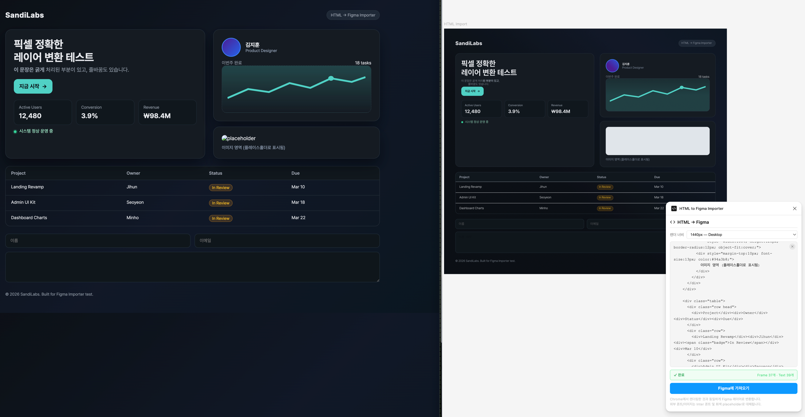

# Figma HTML Importer



Paste any HTML into Figma and get a pixel-accurate layer tree. The plugin renders your markup in a
real browser engine, extracts every computed style, and rebuilds the result as native Figma frames,
text nodes, and vectors.

## Features

### Rendering

- **Full HTML documents or fragments** — works with a complete `<!DOCTYPE html>` page or a bare
  `<div>` snippet.
- **Tailwind CSS support** — automatically loads the Tailwind Play CDN and injects your
  `tailwind.config` so custom theme colors, utilities, and arbitrary values all work.
- **Custom `<style>` blocks** — any CSS you include in the HTML is injected and applied before
  serialization.
- **Responsive viewport** — choose from 6 render-width presets (375 px Mobile through 3840 px Extra
  Wide) to capture the exact breakpoint you need.

### Styles

- **Backgrounds** — solid colors, linear gradients (angle, direction, multi-stop), and transparent
  fills.
- **Borders** — per-side widths, colors, and styles with inside stroke alignment.
- **Corner radius** — uniform or per-corner values.
- **Box shadows** — offset, blur, spread, and color mapped to Figma drop shadows.
- **Opacity & overflow** — element opacity and `overflow: hidden` mapped to `clipsContent`.

### Typography

- **28+ font families mapped** including Inter, Roboto, Poppins, Pretendard, Noto Sans KR, and all
  common system fonts.
- **Korean font fallback chain** — Pretendard > Noto Sans KR > Inter, so Korean text always renders.
- **Font weight 100–900** — mapped to the correct Figma style name with `SemiBold` / `Semi Bold`
  variant handling to avoid silent fallback to Regular.
- **Italic, line-height, letter-spacing, and text-align** all preserved.
- **Bold segments** — inline `<strong>` / `<b>` inside a paragraph are applied as Figma
  character-range overrides.
- **Smart text sizing** — single-line text uses auto-width to prevent wrapping; multi-line text uses
  fixed-width with proper alignment.

### SVG & Images

- **SVG vector import** — `<svg>` elements are passed to `createNodeFromSvg` for native Figma
  vectors.
- **`<use>` inlining** — symbol references are resolved, viewBox scaling is applied, and
  `currentColor` is replaced with the actual computed color.
- **Image placeholders** — `` tags become light-gray rounded rectangles preserving the original
  dimensions.

### Advanced DOM Handling

- **Pseudo-elements** — `::before` and `::after` with backgrounds, gradients, or border-radius (
  e.g., radio-button dots) are extracted as virtual child nodes.
- **Mixed content** — `<p>text <strong>bold</strong> text</p>` is merged into a single Figma text
  node with per-range bold.
- **`<br>` line breaks** — when `<br>` is present, each text segment is measured independently via
  the Range API so line breaks and per-span colors are preserved.
- **Flex centering** — `justify-content: center` and `align-items: center` are translated to Figma
  text positioning. Buttons and links are always vertically centered.
- **CSS color normalization** — oklch, `color(srgb ...)`, space-separated `rgb()`, and any other
  format are converted to legacy `rgb()` via a Canvas 2D round-trip.

## How It Works

1. **Paste HTML** — paste your markup into the text area.
2. **Pick a render width** — select the viewport breakpoint.
3. **Click "Import"** — the plugin renders the HTML off-screen, walks the DOM tree, serializes every
   element's bounding rect and computed style, then sends the data to the Figma sandbox which builds
   the layer tree.
4. **Edit in Figma** — the result is a normal Figma frame you can move, resize, and style.

## Limitations

- External images are shown as placeholder rectangles (Figma plugin sandbox cannot fetch
  cross-origin images).
- Fonts not installed in your Figma account fall back through the chain above.
- `position: fixed` elements are skipped (viewport-relative coordinates do not map to a
  parent-relative tree).
- CSS animations, transitions, and interactive states are not captured.

## Development

```bash
# Install dependencies
npm install

# Development (watch mode)
npm run dev

# Production build
npm run build
```

The build outputs `dist/code.js` (Figma sandbox) and `dist/ui.html` (plugin UI).

## Feedback and Support

If you have questions, run into issues, or want to suggest improvements, please reach out via email
at [swgil007@naver.com](mailto:swgil007@naver.com).
