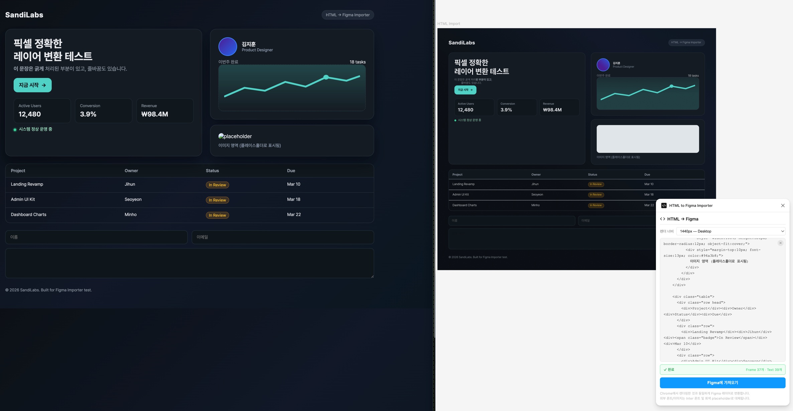

# Figma HTML Importer



Paste any HTML into Figma and get a pixel-accurate layer tree. The plugin renders your markup in a
real browser engine, extracts every computed style, and rebuilds the result as native Figma frames,
text nodes, and vectors.

## Features

### Rendering

- **Full HTML documents or fragments** — works with a complete `<!DOCTYPE html>` page or a bare
  `<div>` snippet. A single element (a button, a card) is imported as a tightly cropped frame; a
  page with several top-level elements or a page background is imported whole.
- **Isolated rendering** — the HTML is rendered in its own sandboxed iframe sized to the chosen
  viewport, so `<head>` styles and `<script>` tags run in document order just like a normal page,
  and nothing leaks between imports. Scripts that throw or call `alert()` cannot break the plugin.
- **External resources** — `<link>` stylesheets, web fonts (Google Fonts, `@font-face`), and
  scripts from any CDN load before capture, and text is measured after the web fonts finish loading.
- **Tailwind CSS support** — the Tailwind Play CDN script in your HTML works as-is, including
  `tailwind.config = {...}` and `<style type="text/tailwindcss">` with `@apply`.
- **Responsive viewport** — choose from 6 presets (375×812 Mobile through 3840×2160 Extra Wide).
  Media queries, Tailwind breakpoints (`md:`, `lg:`), and `vw`/`vh` units are evaluated against that
  viewport.
- **Page background** — `html`/`body` backgrounds (including `<body class="bg-...">`) fill the
  imported frame, following the CSS canvas background rules. Pages without a background get white,
  as in the browser.

### Styles

- **Backgrounds** — solid colors and stacked linear, radial, and conic gradients. Linear gradients
  are drawn in the same direction as the browser (angles, side/corner keywords, non-square boxes);
  radial gradients keep their center, shape, and size keyword (`closest-side`, `farthest-corner`, …).
  Color stops can be percentages, px, or angles.
- **Modern color syntax** — `oklch()`, `oklab()`, `color()`, and `color-mix()` (Tailwind v4's
  default palette) in backgrounds, gradients (including `in oklab` interpolation hints), shadows,
  borders, and SVG paints are converted to colors Figma understands.
- **Gradient text** — `background-clip: text` with transparent text becomes a gradient text fill.
- **Borders** — per-side widths with inside stroke alignment; `dashed` and `dotted` borders become
  dashed strokes. Sides with different colors (a colored left accent on a gray box) are drawn as one
  rectangle per side so each keeps its color.
- **Corner radius** — uniform or per-corner values, with percentages resolved against the element
  size.
- **Box shadows** — every layer of a multi-layer shadow (Tailwind `shadow-*` included) becomes a Figma
  drop or inner shadow with offset, blur, spread, and color. Spread-only rings on transparent
  elements (Tailwind `ring-*`) become strokes.
- **Blur and blend modes** — `filter: blur()` becomes a layer blur, `backdrop-filter: blur()` a
  background blur (Figma's blur radius is twice the CSS value), `filter: drop-shadow()` a drop shadow,
  and `mix-blend-mode` the layer blend mode. `text-shadow` becomes a drop shadow on the text layer.
- **Opacity & overflow** — element opacity (including `opacity: 0`), and `overflow` other than
  `visible` (hidden, clip, auto, scroll) on either axis mapped to `clipsContent`. Frames keep the
  element's own size, so overflowing children never stretch a background.

### Typography

- **Installed fonts first** — each `font-family` in the CSS stack is looked up in the fonts your
  Figma can use (`listAvailableFonts`), in order, so brand fonts you have installed are used as-is.
  System fonts and generic families (`-apple-system`, `Segoe UI`, `sans-serif`, …) fall back to Inter,
  Roboto Mono, and friends.
- **Korean text** — Korean text set in a system font uses Pretendard, or Noto Sans KR when Pretendard
  is not installed.
- **Font weight 100–900 and italic** — matched against the style names the font actually has
  (`SemiBold` / `Semi Bold` / `600`, `Italic` vs `Regular Italic`), picking the closest weight the way
  CSS font matching does.
- **Italic, line-height, letter-spacing, text-align, and text-transform** all preserved
  (`uppercase` / `lowercase` / `capitalize` become Figma text case).
- **Styled inline runs** — inline `<strong>`, `<em>`, `<a>`, `<span>`, … inside a paragraph become
  character-range overrides for weight, italic, font family, size, color, underline/strike-through,
  text case, and letter spacing.
- **Measured text placement** — every text layer is placed on the glyph area the browser actually
  drew (measured with the Range API), so padding, flex/grid alignment, and `text-align` (including
  `start`/`end`) land exactly. Text that wraps in the browser keeps the element's content width and
  wraps at the same place; single-line text uses auto-width so it never wraps unexpectedly.
- **Whitespace** — source indentation and line breaks collapse like the browser does, while `pre`,
  `pre-wrap`, and `pre-line` keep theirs.
- **Truncation** — `text-overflow: ellipsis` and `-webkit-line-clamp` become Figma ending
  truncation with the same max lines.

### SVG & Images

- **SVG vector import** — `<svg>` elements are passed to `createNodeFromSvg` for native Figma
  vectors.
- **CSS-styled icons** — `fill`, `stroke`, `stroke-width`, opacity, and friends set from CSS
  (classes, `<style>`, Tailwind `fill-*`/`stroke-*`, inherited `color` for `currentColor`, CSS
  variables) are written onto the SVG so Figma draws the same colors. SVGs without a `viewBox` keep their
  coordinate system when resized with CSS.
- **`<use>` inlining** — sprite references are resolved (symbol `viewBox`, `x`/`y` offsets, and
  references to plain elements), and gradients or clip paths defined in another SVG's `<defs>` are
  copied in.
- **Images** — `` (the `srcset` candidate the browser picked), CSS `background-image: url()`
  (`cover`, `contain`, repeating tiles), `<canvas>` drawings, and `<video>` posters become Figma image
  fills with `object-fit` respected. SVG, WebP, and AVIF images, and images larger than 4096px, are
  converted to PNG first. Images that cannot be fetched become gray placeholders of the same size.

### Advanced DOM Handling

- **Pseudo-elements** — `::before` and `::after` with backgrounds, gradients, or border-radius
  (e.g., radio-button dots, notification badges) are extracted as virtual child nodes, including
  `translate()` centering. Inline text content (bullets, arrows, the `*` after a required label) is
  placed right before the first line or right after the last line of the element's text.
- **List markers** — `list-style-type` bullets (`disc`, `circle`, `square`) and numbers (`decimal`,
  alphabetic, roman, custom strings) appear next to each item, honoring `<ol start>`, `<li value>`,
  `reversed`, and `list-style-position`.
- **Mixed content** — `<p>text <strong>bold</strong><br>text</p>` becomes a single Figma text node
  with styled ranges and line breaks. Inline pieces that draw their own box — badges with a
  background, icons, `inline-block` or `display: block` children — stay separate layers at their
  measured positions. Children hidden with `display: none` are left out.
- **Auto Layout (optional)** — with "flex 를 Auto Layout 으로 변환" checked, flex containers become
  Figma Auto Layout frames (direction, gap, padding, `justify-content`, `align-items`, stretched
  children, absolutely positioned children kept in place). A container is converted only when the
  layout Figma would compute matches the browser within 1.5px, so margins, wrapping, or
  `space-around` stay absolutely positioned instead of shifting.
- **Layer names** — layers are named from `data-name` (or `data-figma-name`), `id`, `aria-label`,
  image `alt`, button/link text, or a meaningful class name; utility classes (Tailwind) are ignored.
  The imported frame takes the document `<title>`.
- **Stacking order** — sibling layers are ordered the way CSS paints them: negative `z-index`, then
  in-flow content, then positioned elements, then positive `z-index` (flex and grid items honor
  `z-index` without `position`), so overlays declared first still land on top.
- **Rotation** — elements rotated with `transform` or the `rotate` property (rotated chevrons,
  tilted badges) keep their real size and are rotated in Figma around the same `transform-origin`.
- **Zero-size wrappers and `display: contents`** — children of zero-size absolutely positioned
  wrappers and of `display: contents` elements are kept at their real positions. Positions and sizes
  keep two decimal places, so 0.5px hairlines survive.
- **Form controls** — input and textarea values or placeholders (with the `::placeholder` color),
  the selected `<option>` label with its dropdown arrow, and masked passwords. Native checkboxes,
  radios, range sliders, and color inputs are drawn as vectors, including the checked state and
  `accent-color`.
- **CSS color normalization** — oklch, `color(srgb ...)`, space-separated `rgb()`, and any other
  format are converted to legacy `rgb()` via a Canvas 2D round-trip.

## How It Works

1. **Paste HTML** — paste your markup into the text area, or open / drag-and-drop an `.html` file.
   The last input, width, and options are remembered for the next run.
2. **Pick a render width** — select a viewport preset, or "375 · 768 · 1440 — 나란히" to import the
   mobile, tablet, and desktop layouts side by side in one go.
3. **Pick options** — convert flex containers to Auto Layout, and/or place the result inside the
   selected frame instead of the canvas.
4. **Click "Import"** — the plugin renders the HTML in an off-screen iframe, walks the DOM tree,
   serializes every element's bounding rect, measured text boxes, and computed style, fetches the
   referenced images, then sends the data to the Figma sandbox which builds the layer tree.
5. **Watch progress** — large pages report `built / total` nodes while building. If some elements
   cannot be created, the rest is still built and the count with the first error is shown.
6. **Edit in Figma** — the result is a normal Figma frame you can move, resize, and style.

## Limitations

- Images served without CORS headers (`Access-Control-Allow-Origin`) cannot be read by the plugin and
  are shown as placeholders.
- Fonts that are not available in your Figma fall back as described above.
- `position: fixed` elements are placed relative to the whole page, so a fixed bottom bar ends up at
  the bottom of the imported frame.
- CSS animations, transitions, and interactive states are not captured.

## Development

```bash
# Install dependencies
npm install

# Development (watch mode)
npm run dev

# Production build
npm run build
```

The build outputs `dist/code.js` (Figma sandbox) and `dist/ui.html` (plugin UI).

### Regression tests

```bash
# Build, then run every case in test/cases.mjs
npm test

# Run a subset, or run the cases against another build output
node test/run.mjs --grep shadow
node test/run.mjs --dist path/to/other/dist
```

The runner loads the built `dist/ui.html` in a 400×580 frame (the real plugin size) and executes
`dist/code.js` on top of a Figma API mock (`test/figma-mock.js`). The mock rejects the same calls the
real sandbox rejects — editing text with an unloaded font, resizing below 0.01, unsupported image
formats, invalid SVG — so runtime errors surface in the test run. Each case in `test/cases.mjs`
imports a small HTML snippet and asserts on the resulting node tree with numbers (positions, sizes,
fills, effects, font styles). It uses the installed Google Chrome, or a Playwright Chromium if Chrome
is missing (`npx playwright install chromium`).

## Feedback and Support

If you have questions, run into issues, or want to suggest improvements, please reach out via email
at [swgil007@naver.com](mailto:swgil007@naver.com).
